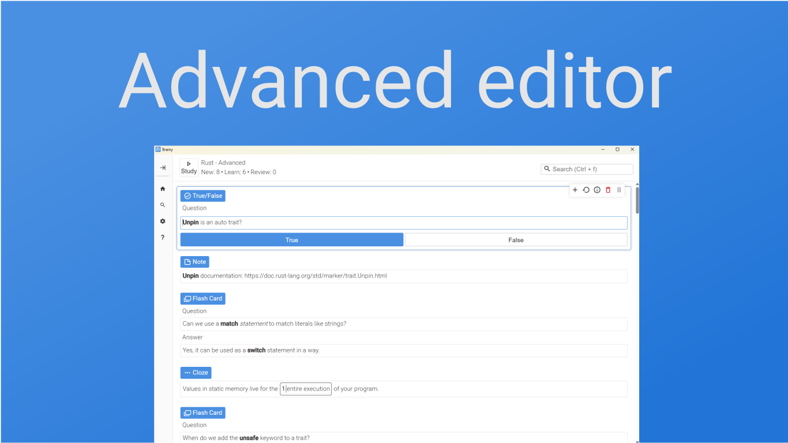
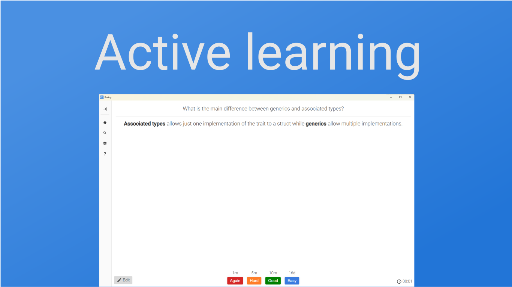
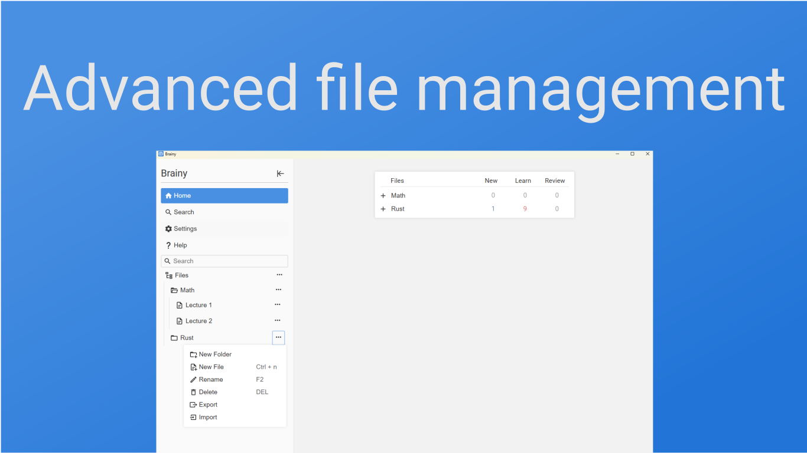
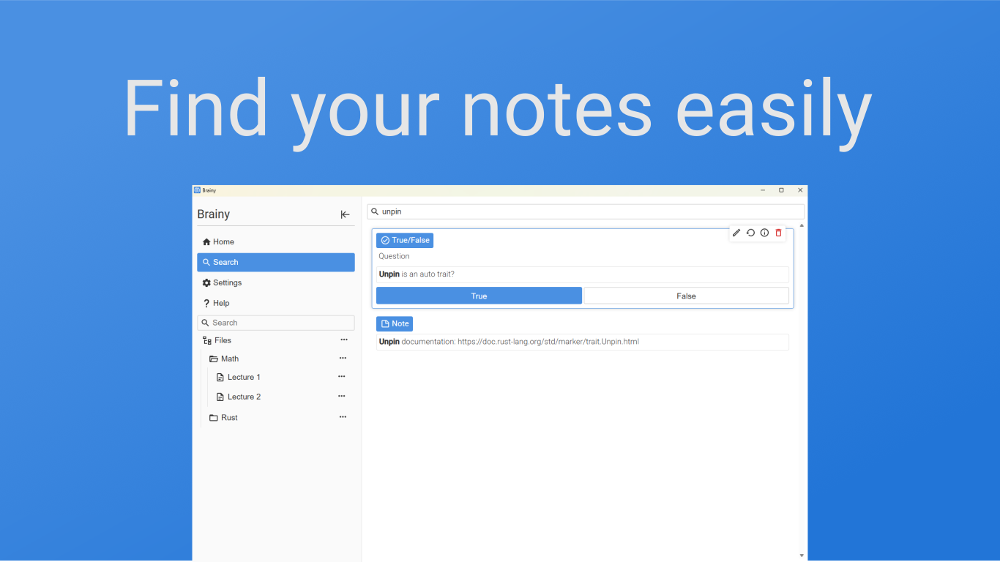

<h1 align="center" style="border-bottom: none">
    <b>
        🧠 Brainy 
     
    Free and open source learning app 
     
    

</h1>

Brainy is a learning app with focus on active repetitions, and spaced learning.

## Key features:

- **Notebook Style Files:** Seamlessly organize notes and ideas all in one
place.
  
- **Structured Folders and Files:** Easily manage and access your study 
materials with robust organization.
  
- **Active Learning and Spaced Repetitions:** Retain knowledge effectively 
with scientifically-backed methods.
  
- **Interactive Tools:** Dive into flash cards and cloze exercises for dynamic 
study sessions.

- **Efficient Keyboard Shortcuts:** Navigate the app quickly to enhance your 
learning experience.

- **Advanced File Management:** Efficiently store and organize your notes and 
files using our sophisticated file management system.

## User installation
[Download Brainy Desktop (Windows, macOS and Linux)](https://github.com/ramialkawadri/Brainy/releases)

## Roadmap

Brainy is still in beta phase until it has been tested thoroughly and all 
bugs found are fixed.
